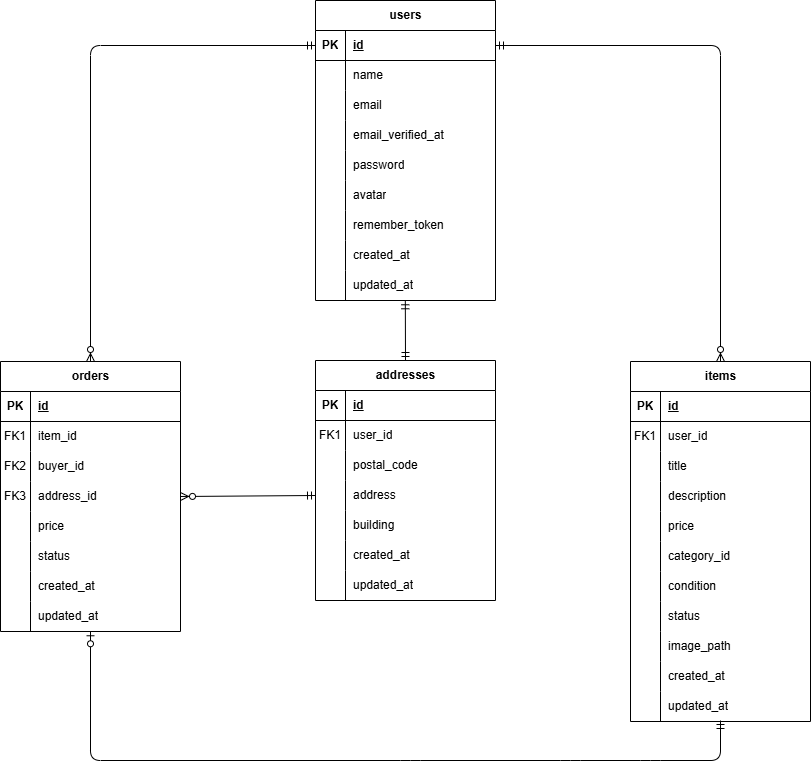

# Flea Market App（フリマアプリ）

## プロジェクト概要

本アプリは、フリマアプリの基本機能を実装したものです。
ユーザー登録・ログイン、商品一覧表示、商品詳細、購入処理などの基本的な EC 機能を備えています。

**主な機能：**

- ユーザー登録 / ログイン / ログアウト
- 商品一覧表示・詳細表示
- 商品購入 / 出品
- 画像アップロード（storage 連携）

## Docker ビルド

1. リポジトリをクローン
   ```bash
   git clone <REPOSITORY_URL>
   ```
2. コンテナをビルド
   ```bash
   docker compose up -d --build
   ```

## 環境構築

1. PHP コンテナに入る
   ```bash
   docker compose exec php bash
   ```
2. Composer インストール
   ```bash
   composer install
   ```
3. `.env` ファイルを作成し、環境変数を適宜変更
   ```bash
   cp .env.example .env
   ```
4. アプリケーションキー作成
   ```bash
   php artisan key:generate
   ```
5. マイグレーション実行
   ```bash
   php artisan migrate
   ```
6. シーディング実行
   ```bash
   php artisan db:seed
   ```

## 使用技術（実行環境）

- PHP **8.2**
- Laravel **8.x**
- MySQL **8.0.26**
- nginx **1.21.1**
- Docker / Docker Compose
- phpMyAdmin
- MailHog（メール確認用）

## ER図



## URL一覧

- トップページ：http://localhost/
- ユーザ登録画面：http://localhost/register
- phpMyAdmin：http://localhost:8080/
- MailHog（メール確認）：http://localhost:8025/

